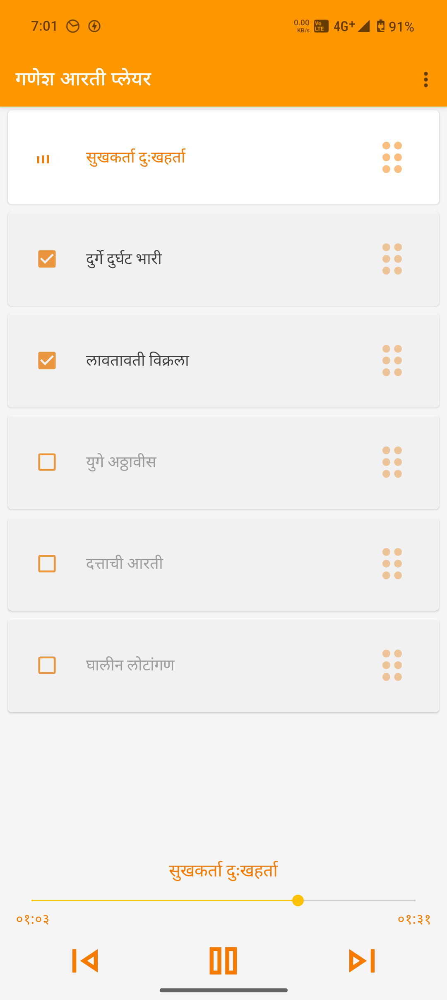
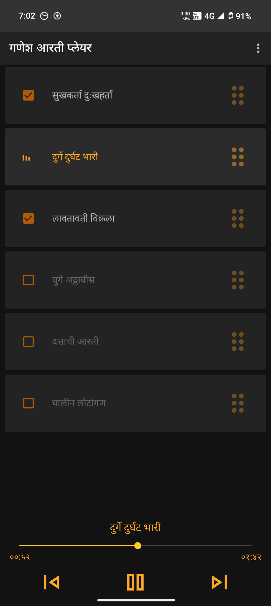
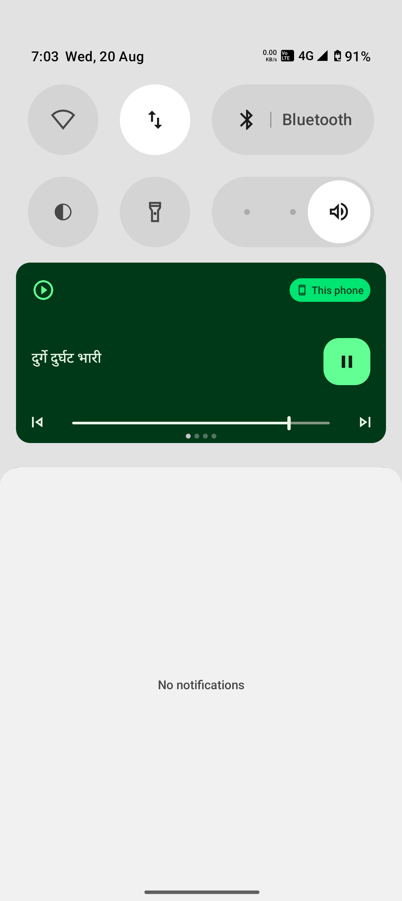

# Ganesh Aarties Player

**An open-source Android application for listening to a collection of devotional Ganesh Aarties.**

<!-- Optional: Add more badges like build status, last commit, etc. if you set them up -->

This application provides a simple and intuitive interface to play, manage, and enjoy a curated list of Ganesh Aarties. It features background playback, notification controls, and theme customization.

## Features

*   **Curated Aarti Collection:** Comes pre-loaded with popular Ganesh Aarties.
*   **Background Playback:** Continue listening to Aarties even when the app is in the background or the screen is off.
*   **Notification Controls:** Manage playback (play/pause, next, previous) directly from the notification panel.
*   **Playlist Management:**
    *   Select specific Aarties to include in your playback queue.
    *   Reorder Aarties in the playlist (drag and drop when playback is paused).
*   **Theme Customization:** Choose between Light, Dark, or System default themes.
*   **Language Support:** Currently supports English and Marathi (मराठी) for the app interface.
*   **Modern UI:** Built with Material 3 components for a clean and modern look.
*   **Open Source:** Feel free to explore the code, learn from it, and contribute!

## Screenshots

      
      
      
    

## User Guide

### Installing the Application

There are a few ways to install the Ganesh Aarties Player:

**1. From an APK file (if provided):**

If a pre-built `.apk` file is available (e.g., in the "Releases" section of the GitHub repository):
1.  Download the `.apk` file to your Android device.
2.  You may need to enable "Install from unknown sources" in your Android settings.
    *   Go to **Settings > Apps > Special app access > Install unknown apps**.
    *   Select your browser or file manager app and toggle "Allow from this source".
3.  Open your file manager, navigate to the downloaded `.apk` file, and tap on it to install.
4.  Follow the on-screen prompts.

**2. Building from Source (for developers/advanced users):**

See the [Building from Source](#building-from-source) section below.

### Using the Application

1.  **Main Screen:**
    *   Upon launching the app, you'll see a list of available Ganesh Aarties.
    *   Each Aarti has a checkbox next to it.

2.  **Selecting Aarties for Playback:**
    *   Tap the checkbox next to each Aarti you want to include in your current playlist.
    *   Selected Aarties will be added to the playback queue in the order they appear in the list (unless reordered).

3.  **Controlling Playback:**
    *   **Player Controls Bar:** Located at the bottom of the screen.
        *   **Play/Pause Button:** Toggles between playing and pausing the current Aarti.
        *   **Next Button:** Skips to the next Aarti in your selected playlist.
        *   **Previous Button:** Goes back to the previous Aarti in your selected playlist.
        *   **Seek Bar:** Shows the progress of the current Aarti. You can drag the slider to seek to a specific point.
        *   **Current Aarti Name:** Displays the title of the Aarti currently playing or paused.
        *   **Timers:** Show the current playback time and total duration of the Aarti.
    *   **Notification Controls (Android 13+ requires notification permission):**
        *   When an Aarti is playing (or paused), a notification will appear with playback controls.
        *   You can play/pause, skip to the next/previous Aarti directly from the notification without opening the app.

4.  **Managing the Playlist Order (Drag and Drop):**
    *   To reorder the Aarties in the main list (and thus in the playback queue if they are selected):
        1.  **Ensure playback is PAUSED.** Drag and drop is disabled while an Aarti is actively playing.
        2.  **Long-press** on the drag handle (usually represented by lines or dots, or simply long-press the item) next to an Aarti item.
        3.  **Drag** the Aarti item up or down to your desired position in the list.
        4.  **Release** to set the new order.
    *   The player will play the *selected* Aarties in the order they appear in this list.

5.  **Changing the Theme:**
    1.  Tap the **menu icon** (three dots) in the top-right corner of the toolbar.
    2.  Select "Theme".
    3.  Choose from:
        *   **Light:** A light color scheme.
        *   **Dark:** A dark color scheme (easier on the eyes in low light).
        *   **System default:** Follows your phone's system-wide light/dark mode setting.
    *   The app will instantly update to the selected theme.

6.  **Changing the Language:**
    1.  Tap the **menu icon** (three dots) in the top-right corner of the toolbar.
    2.  Select "Change Language".
    3.  Choose between "English" or "मराठी (Marathi)".
    4.  The app will restart and apply the selected language to its interface.

7.  **Notification Permission (Android 13+):**
    *   On Android 13 and newer, the app will ask for permission to send you notifications.
    *   This permission is needed to show the playback controls in the notification shade.
    *   If you deny the permission, audio will still play, but you won't see the notification controls. You can grant the permission later from your phone's app settings.

## Building from Source

If you're a developer and want to build the app from its source code:

1.  **Prerequisites:**
    *   [Android Studio](https://developer.android.com/studio) (latest stable version recommended).
    *   Git (for cloning the repository).

2.  **Clone the Repository:**